# ERD — ERP Dian Mustika

**Sumber kebenaran:** `01_PRD_ERP_Dian_Mustika_Database_Architecture.md` §31
**Status:** Implementasi final Fase 1 — schema sudah dibuat di MySQL dan divalidasi oleh `tests/Feature/DatabaseSchemaTest.php`
**Generated:** 2026-01-01 dari skema MySQL aktual (`erp_dian_mustika`), bukan dari asumsi manual

## Cara Baca

| Simbol | Arti |
|---|---|
| `PK` | Primary key (`id BIGINT UNSIGNED`) |
| `UK` | Unique constraint |
| `||--o{` | Exactly one → zero or more (FK nullable tidak ditandai `?`) |
| `decimal` | `DECIMAL(20,2)` untuk uang, `DECIMAL(20,4)` untuk quantity |
| `ts` | `TIMESTAMP` |

## Aturan Relasi

### Foreign key
Seluruh FKRON dan wajib ter-index. `RESTRICT` dipakai bila menghapus parent akan merusak histori; `NULL ON DELETE` bila kolom nullable dan penghapusan parent tidak berbahaya; `CASCADE` hanya untuk anak yang tidak punya nilai histori (detail item, pivot).

### Aturan referensial

| Action | Jumlah FK | Contoh |
|---|---|---|
| `RESTRICT` | 47 | `employees.branch_id`, `purchase_orders.supplier_id`, `products.category_id` — parent tidak boleh dihapus selama anak ada |
| `SET NULL` | 70 | `employees.manager_id`, `sales_transactions.customer_id`, `payments.financial_account_id` — kolom nullable, histori transaksi tetap utuh |
| `CASCADE` | 32 | `purchase_order_items.purchase_order_id`, `role_user.role_id`, `media_attachments.media_file_id` — anak tanpa nilai histori |

Hanya tabel detail/pivot yang memakai `CASCADE`. Semua tabel header transaksi tidak pernah cascade, sehingga penghapusan header otomatis terblokir database.

### Self Reference

| Tabel | Kolom | On delete |
|---|---|---|
| `employees` | `manager_id` → `employees.id` | SET NULL |
| `product_categories` | `parent_id` → `product_categories.id` | SET NULL |
| `service_categories` | `parent_id` → `service_categories.id` | SET NULL |
| `expense_categories` | `parent_id` → `expense_categories.id` | SET NULL |

### Relasi logis (polymorphic / logical reference)
Empat tabel memakai referensi logis, bukan FK constraint:

| Tabel | Kolom | Digunakan oleh |
|---|---|---|
| `payments` | `transaction_type` + `transaction_id` | Sales, Purchase, Expense, Bill, Payroll. Validasi di service layer. |
| `approval_requests` | `request_type` + `request_id` | PO, Expense, StockTransfer, StockOpname, Payroll, PayrollAdjustment, BankReconciliation |
| `inventory_movements` | `reference_type` + `reference_id` | Sumber mutasi stok (PO receipt, sales, transfer, opname) |
| `payroll_items` | `source_type` + `source_id` | Asal komponen payroll (attendance, overtime, commission, BPJS, adjustment) |
| `digital_accounts` | `owner_type` + `owner_id` | Pemilik akun digital |
| `media_attachments` | `attachable_type` + `attachable_id` | File pada Employee, Customer, Product, Asset, Supplier, Branch, transaksi |

### Cardinality kunci
- `companies 1:N branches` — satu cabang selalu milik satu perusahaan
- `employees N:1 branches` — employee tidak boleh lintas cabang
- `employees N:1 employees (manager_id)` — self relation, nullable
- `inventory_stocks 1:1 products` per warehouse — unique `(warehouse_id, product_id)`
- `payrolls 1:1 employees` per period — unique `(payroll_period_id, employee_id)`
- `attendances 1:1 employees` per hari — unique `(employee_id, attendance_date)`
- `service_package_items N:M services` — unique `(package_id, service_id)`
- `role_user`, `permission_role` — pivot dengan unique pair

## Relasi Utama (PRD 01 §26)

```text
Company
  ├── Branch
  │    ├── Employee ──┬── Family Members
  │    │              ├── Insurance/BPJS
  │    │              ├── Salary Structure / Components
  │    │              ├── Attendance / Overtime
  │    │              ├── Commission ──▶ Payroll ──▶ Payslip
  │    │              └── Booking Items
  │    ├── Warehouse ─┬── Inventory Stocks (current balance)
  │    │              ├── Inventory Movements (ledger)
  │    │              ├── Stock Transfers
  │    │              └── Stock Opnames
  │    ├── Sales Transactions ──▶ Items ──┬── Product
  │    │                                   ├── Service
  │    │                                   └── Package
  │    ├── Purchase Orders ──▶ Goods Receipts ──▶ Inventory Movements
  │    └── Financial Accounts ──▶ Payments
  │                            └── Bank Transactions ──▶ Reconciliations
  └── Department ──▶ Position

Service ──┬── Service Prices (DURATION | WEIGHT)
          ├── Package Items
          └── Commission Rules ──▶ Employee Commissions
```

## Peta Domain

| Domain | Tabel | Relasi FK |
|---|---|---|
| Organization | 4 | 3 |
| User, Role, Permission | 5 | 5 |
| Employee | 3 | 6 |
| Customer | 1 | 0 |
| Product | 5 | 5 |
| Service | 3 | 3 |
| Package | 2 | 2 |
| Supplier & Purchasing | 8 | 19 |
| Inventory | 7 | 17 |
| Booking | 2 | 7 |
| Sales | 4 | 16 |
| Payment | 4 | 6 |
| Bank & Reconciliation | 2 | 4 |
| Bills | 2 | 5 |
| Expense | 2 | 8 |
| Payroll | 7 | 11 |
| Commission | 2 | 4 |
| Payslip | 3 | 5 |
| Attendance & Shift | 4 | 8 |
| Asset & Document | 5 | 8 |
| Digital Account | 2 | 1 |
| Approval & Audit | 2 | 0 |

Total: **79 tabel bisnis**, **143 foreign key constraint**, plus 7 tabel infrastruktur Laravel (`migrations`, `sessions`, `cache`, `cache_locks`, `jobs`, `job_batches`, `failed_jobs`).


### Tabel dengan Relasi Logis

Tabel berikut tidak memiliki FK constraint ke tabel target karena target-nya
bergantung pada nilai kolom enum. Tetap ter-index untuk performa lookup.

#### `payments` — sumber transaksi polymorphic
```text
transaction_type = SALES      → sales_transactions.id
transaction_type = PURCHASE   → purchase_invoices.id
transaction_type = EXPENSE    → expenses.id
transaction_type = BILL       → bills.id
transaction_type = PAYROLL    → payrolls.id
transaction_type = OTHER      → (external/manual)
```
Index: `(transaction_type, transaction_id)`. Amount tetap `DECIMAL(20,2)` dan tidak boleh mencatat ganda — PRD 02 §15 melarang pendapatan tercatat dua kali karena payment dan bank mutation sama-sama masuk; `bank_reconciliations` yang menjembatani keduanya.

#### `approval_requests` — target approval
```text
request_type = PURCHASE_ORDER       → purchase_orders.id
request_type = EXPENSE              → expenses.id
request_type = STOCK_TRANSFER       → stock_transfers.id
request_type = STOCK_OPNAME         → stock_opnames.id
request_type = PAYROLL              → payrolls.id
request_type = PAYROLL_ADJUSTMENT   → payroll_adjustments.id
request_type = BANK_RECONCILIATION  → bank_reconciliations.id
```
Resolusi model dilakukan di `ApprovalRequest::modelForType()`.

#### `inventory_movements` — asal mutasi
`reference_type` menunjuk class model sumber (`GoodsReceipt::class`, `SalesTransaction::class`, `StockTransfer::class`, `StockOpname::class`). Index `(reference_type, reference_id)` untuk tracing mutasi ke dokumen asalnya.

#### `payroll_items` — asal komponen gaji
`source_type` mencatat mechanism sumber (`BASIC`, `ALLOWANCE`, `ATTENDANCE`, `OVERTIME`, `COMMISSION`, `BPJS`, `ADJUSTMENT`) dengan `source_id` ke tabel asal. Komponen bersifat snapshot: `component_name` disimpan apa adanya sehingga perubahan master `salary_components` tidak mengubah payroll lama.

---

## Soft Delete (PRD 01 §3)

Tujuh master data memakai `deleted_at`, sehingga tidak hilang secara historis:

| Tabel | Alasan |
|---|---|
| `employees` | Employee dengan transaksi historis tidak boleh dihapus (PRD 02 §7) |
| `customers` | Riwayat sales/booking harus tetap traceable |
| `products` | Transaksi lama merujuk produk yang di-soft-delete |
| `services` | Booking dan sales item lama tetap perlu nama/jenis |
| `service_packages` | Sama seperti services |
| `suppliers` | PO dan invoice lama tetap terhubung |
| `assets` | Asset movement historis tidak boleh hilang |

Tabel transaksi **tidak** memakai soft delete sama sekali — divalidasi oleh
`DatabaseSchemaTest::transaction_tables_are_not_soft_deleted()`.

## Snapshot Historis (PRD 01 §2.3)

| Tabel | Kolom snapshot | Fungsi |
|---|---|---|
| `sales_transaction_items` | `item_name`, `unit_price` | Harga/nama produk, jasa, atau paket tidak berubah meski master berubah |
| `payroll_items` | `component_name` | Nama komponen gaji tidak berubah meski `salary_components` di-rename |
| `payslip_items` | `component_name` | Slip yang sudah terbit tidak ikut berubah |

Harga historis disimpan terpisah di `product_prices` dan `service_prices` dengan
`effective_date` / `end_date`, sehingga perubahan harga master tidak
mengubah transaksi lama.

## Constraint Harga (PRD 01 §9)

- DURATION → `duration_minutes` wajib terisi
- WEIGHT → `min_weight` dan `max_weight` wajib terisi
- Range berat tidak boleh overlap untuk service dan periode yang sama
  (dicek di service layer, bukan DB check constraint)

## Detail per Domain

### Organization (§4)

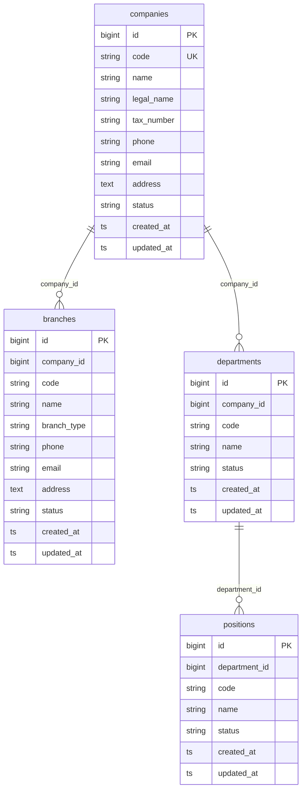
```mermaid
erDiagram
    companies {
        bigint id PK
        string code UK
        string name
        string legal_name
        string tax_number
        string phone
        string email
        text address
        string status
        ts created_at
        ts updated_at
    }
    branches {
        bigint id PK
        bigint company_id
        string code
        string name
        string branch_type
        string phone
        string email
        text address
        string status
        ts created_at
        ts updated_at
    }
    departments {
        bigint id PK
        bigint company_id
        string code
        string name
        string status
        ts created_at
        ts updated_at
    }
    positions {
        bigint id PK
        bigint department_id
        string code
        string name
        string status
        ts created_at
        ts updated_at
    }
    companies ||--o{ branches : company_id
    companies ||--o{ departments : company_id
    departments ||--o{ positions : department_id
```

### User, Role & Permission (§5)

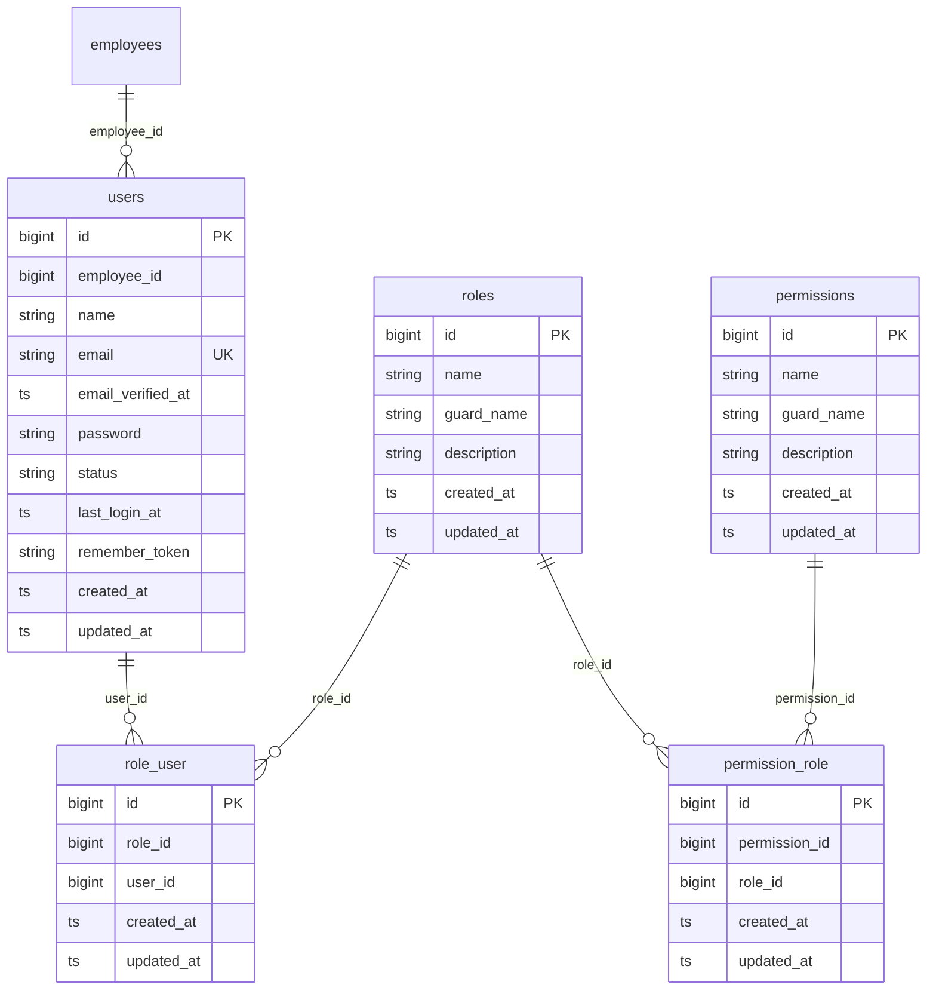
```mermaid
erDiagram
    users {
        bigint id PK
        bigint employee_id
        string name
        string email UK
        ts email_verified_at
        string password
        string status
        ts last_login_at
        string remember_token
        ts created_at
        ts updated_at
    }
    roles {
        bigint id PK
        string name
        string guard_name
        string description
        ts created_at
        ts updated_at
    }
    permissions {
        bigint id PK
        string name
        string guard_name
        string description
        ts created_at
        ts updated_at
    }
    role_user {
        bigint id PK
        bigint role_id
        bigint user_id
        ts created_at
        ts updated_at
    }
    permission_role {
        bigint id PK
        bigint permission_id
        bigint role_id
        ts created_at
        ts updated_at
    }
    employees ||--o{ users : employee_id
    roles ||--o{ role_user : role_id
    users ||--o{ role_user : user_id
    permissions ||--o{ permission_role : permission_id
    roles ||--o{ permission_role : role_id
```

### Employee (§6)

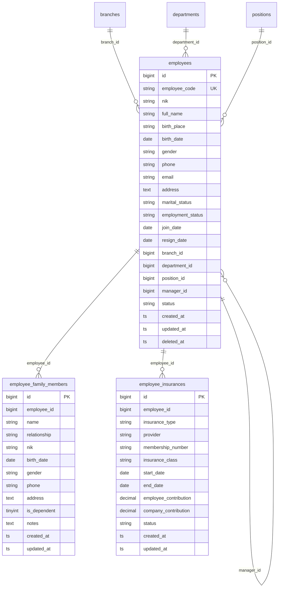
```mermaid
erDiagram
    employees {
        bigint id PK
        string employee_code UK
        string nik
        string full_name
        string birth_place
        date birth_date
        string gender
        string phone
        string email
        text address
        string marital_status
        string employment_status
        date join_date
        date resign_date
        bigint branch_id
        bigint department_id
        bigint position_id
        bigint manager_id
        string status
        ts created_at
        ts updated_at
        ts deleted_at
    }
    employee_family_members {
        bigint id PK
        bigint employee_id
        string name
        string relationship
        string nik
        date birth_date
        string gender
        string phone
        text address
        tinyint is_dependent
        text notes
        ts created_at
        ts updated_at
    }
    employee_insurances {
        bigint id PK
        bigint employee_id
        string insurance_type
        string provider
        string membership_number
        string insurance_class
        date start_date
        date end_date
        decimal employee_contribution
        decimal company_contribution
        string status
        ts created_at
        ts updated_at
    }
    branches ||--o{ employees : branch_id
    departments ||--o{ employees : department_id
    employees ||--o{ employees : manager_id
    positions ||--o{ employees : position_id
    employees ||--o{ employee_family_members : employee_id
    employees ||--o{ employee_insurances : employee_id
```

### Customer (§7)

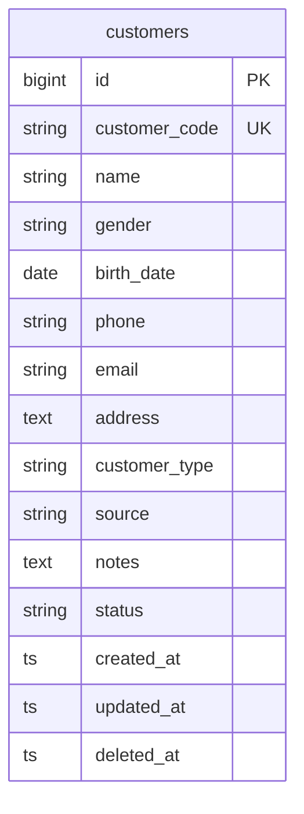
```mermaid
erDiagram
    customers {
        bigint id PK
        string customer_code UK
        string name
        string gender
        date birth_date
        string phone
        string email
        text address
        string customer_type
        string source
        text notes
        string status
        ts created_at
        ts updated_at
        ts deleted_at
    }
```

### Product (§8)

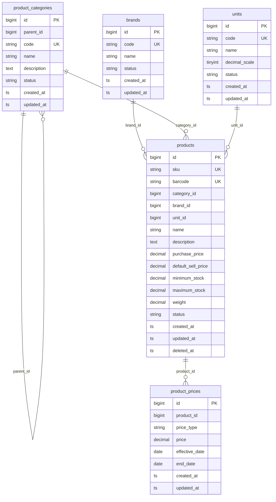
```mermaid
erDiagram
    product_categories {
        bigint id PK
        bigint parent_id
        string code UK
        string name
        text description
        string status
        ts created_at
        ts updated_at
    }
    brands {
        bigint id PK
        string code UK
        string name
        string status
        ts created_at
        ts updated_at
    }
    units {
        bigint id PK
        string code UK
        string name
        tinyint decimal_scale
        string status
        ts created_at
        ts updated_at
    }
    products {
        bigint id PK
        string sku UK
        string barcode UK
        bigint category_id
        bigint brand_id
        bigint unit_id
        string name
        text description
        decimal purchase_price
        decimal default_sell_price
        decimal minimum_stock
        decimal maximum_stock
        decimal weight
        string status
        ts created_at
        ts updated_at
        ts deleted_at
    }
    product_prices {
        bigint id PK
        bigint product_id
        string price_type
        decimal price
        date effective_date
        date end_date
        ts created_at
        ts updated_at
    }
    product_categories ||--o{ product_categories : parent_id
    brands ||--o{ products : brand_id
    product_categories ||--o{ products : category_id
    units ||--o{ products : unit_id
    products ||--o{ product_prices : product_id
```

### Service (§9)

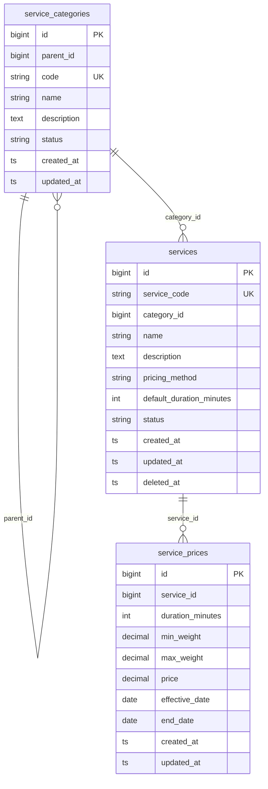
```mermaid
erDiagram
    service_categories {
        bigint id PK
        bigint parent_id
        string code UK
        string name
        text description
        string status
        ts created_at
        ts updated_at
    }
    services {
        bigint id PK
        string service_code UK
        bigint category_id
        string name
        text description
        string pricing_method
        int default_duration_minutes
        string status
        ts created_at
        ts updated_at
        ts deleted_at
    }
    service_prices {
        bigint id PK
        bigint service_id
        int duration_minutes
        decimal min_weight
        decimal max_weight
        decimal price
        date effective_date
        date end_date
        ts created_at
        ts updated_at
    }
    service_categories ||--o{ service_categories : parent_id
    service_categories ||--o{ services : category_id
    services ||--o{ service_prices : service_id
```

### Package (§10)

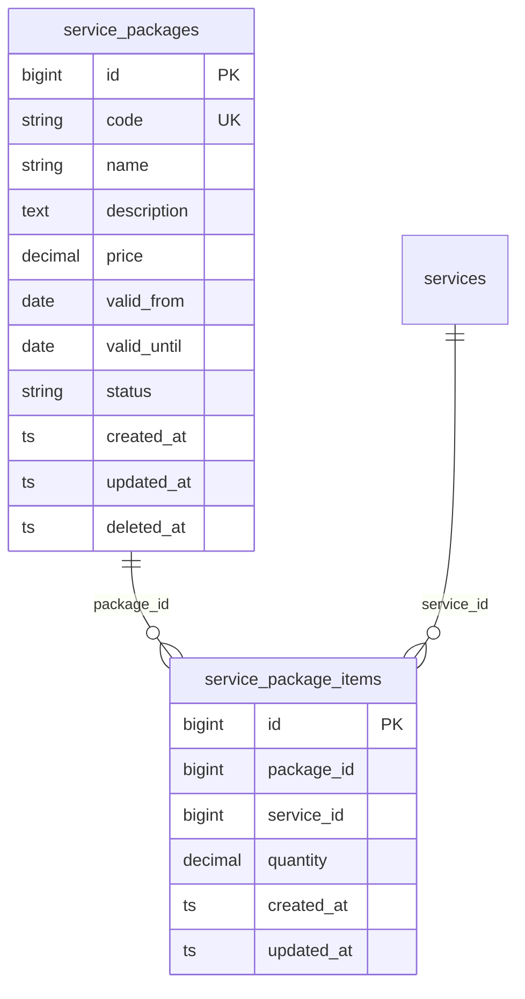
```mermaid
erDiagram
    service_packages {
        bigint id PK
        string code UK
        string name
        text description
        decimal price
        date valid_from
        date valid_until
        string status
        ts created_at
        ts updated_at
        ts deleted_at
    }
    service_package_items {
        bigint id PK
        bigint package_id
        bigint service_id
        decimal quantity
        ts created_at
        ts updated_at
    }
    service_packages ||--o{ service_package_items : package_id
    services ||--o{ service_package_items : service_id
```

### Supplier & Purchasing (§11)

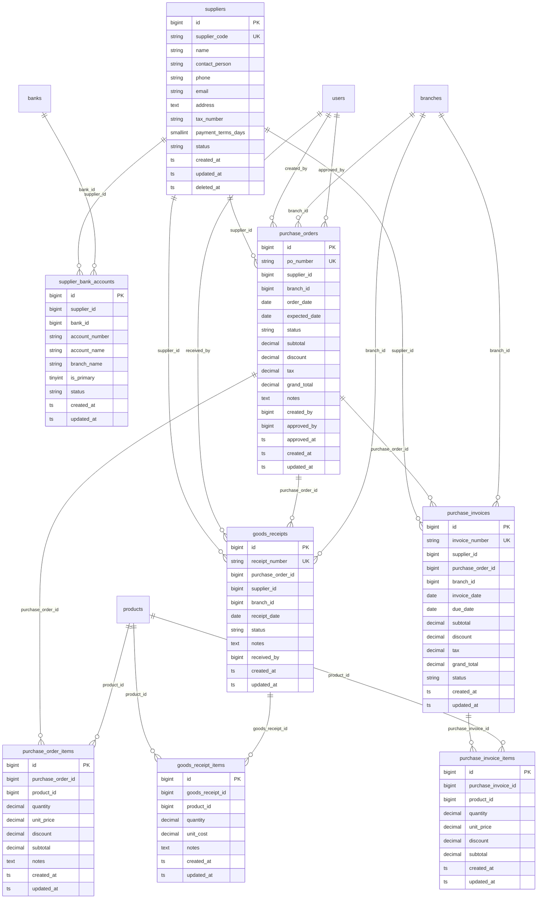
```mermaid
erDiagram
    suppliers {
        bigint id PK
        string supplier_code UK
        string name
        string contact_person
        string phone
        string email
        text address
        string tax_number
        smallint payment_terms_days
        string status
        ts created_at
        ts updated_at
        ts deleted_at
    }
    supplier_bank_accounts {
        bigint id PK
        bigint supplier_id
        bigint bank_id
        string account_number
        string account_name
        string branch_name
        tinyint is_primary
        string status
        ts created_at
        ts updated_at
    }
    purchase_orders {
        bigint id PK
        string po_number UK
        bigint supplier_id
        bigint branch_id
        date order_date
        date expected_date
        string status
        decimal subtotal
        decimal discount
        decimal tax
        decimal grand_total
        text notes
        bigint created_by
        bigint approved_by
        ts approved_at
        ts created_at
        ts updated_at
    }
    purchase_order_items {
        bigint id PK
        bigint purchase_order_id
        bigint product_id
        decimal quantity
        decimal unit_price
        decimal discount
        decimal subtotal
        text notes
        ts created_at
        ts updated_at
    }
    goods_receipts {
        bigint id PK
        string receipt_number UK
        bigint purchase_order_id
        bigint supplier_id
        bigint branch_id
        date receipt_date
        string status
        text notes
        bigint received_by
        ts created_at
        ts updated_at
    }
    goods_receipt_items {
        bigint id PK
        bigint goods_receipt_id
        bigint product_id
        decimal quantity
        decimal unit_cost
        text notes
        ts created_at
        ts updated_at
    }
    purchase_invoices {
        bigint id PK
        string invoice_number UK
        bigint supplier_id
        bigint purchase_order_id
        bigint branch_id
        date invoice_date
        date due_date
        decimal subtotal
        decimal discount
        decimal tax
        decimal grand_total
        string status
        ts created_at
        ts updated_at
    }
    purchase_invoice_items {
        bigint id PK
        bigint purchase_invoice_id
        bigint product_id
        decimal quantity
        decimal unit_price
        decimal discount
        decimal subtotal
        ts created_at
        ts updated_at
    }
    banks ||--o{ supplier_bank_accounts : bank_id
    suppliers ||--o{ supplier_bank_accounts : supplier_id
    users ||--o{ purchase_orders : approved_by
    branches ||--o{ purchase_orders : branch_id
    users ||--o{ purchase_orders : created_by
    suppliers ||--o{ purchase_orders : supplier_id
    products ||--o{ purchase_order_items : product_id
    purchase_orders ||--o{ purchase_order_items : purchase_order_id
    branches ||--o{ goods_receipts : branch_id
    purchase_orders ||--o{ goods_receipts : purchase_order_id
    users ||--o{ goods_receipts : received_by
    suppliers ||--o{ goods_receipts : supplier_id
    goods_receipts ||--o{ goods_receipt_items : goods_receipt_id
    products ||--o{ goods_receipt_items : product_id
    branches ||--o{ purchase_invoices : branch_id
    purchase_orders ||--o{ purchase_invoices : purchase_order_id
    suppliers ||--o{ purchase_invoices : supplier_id
    products ||--o{ purchase_invoice_items : product_id
    purchase_invoices ||--o{ purchase_invoice_items : purchase_invoice_id
```

### Inventory (§12)

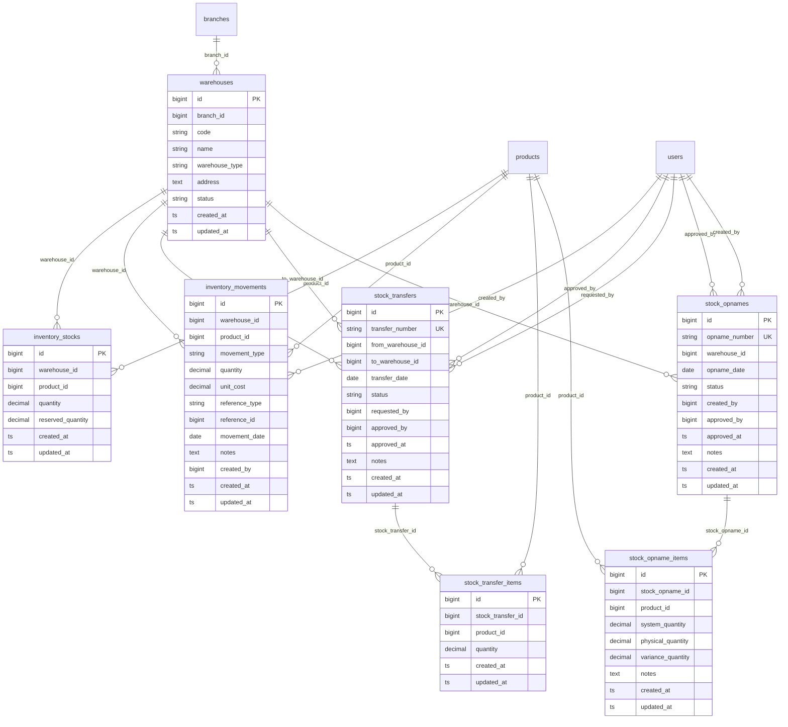
```mermaid
erDiagram
    warehouses {
        bigint id PK
        bigint branch_id
        string code
        string name
        string warehouse_type
        text address
        string status
        ts created_at
        ts updated_at
    }
    inventory_stocks {
        bigint id PK
        bigint warehouse_id
        bigint product_id
        decimal quantity
        decimal reserved_quantity
        ts created_at
        ts updated_at
    }
    inventory_movements {
        bigint id PK
        bigint warehouse_id
        bigint product_id
        string movement_type
        decimal quantity
        decimal unit_cost
        string reference_type
        bigint reference_id
        date movement_date
        text notes
        bigint created_by
        ts created_at
        ts updated_at
    }
    stock_transfers {
        bigint id PK
        string transfer_number UK
        bigint from_warehouse_id
        bigint to_warehouse_id
        date transfer_date
        string status
        bigint requested_by
        bigint approved_by
        ts approved_at
        text notes
        ts created_at
        ts updated_at
    }
    stock_transfer_items {
        bigint id PK
        bigint stock_transfer_id
        bigint product_id
        decimal quantity
        ts created_at
        ts updated_at
    }
    stock_opnames {
        bigint id PK
        string opname_number UK
        bigint warehouse_id
        date opname_date
        string status
        bigint created_by
        bigint approved_by
        ts approved_at
        text notes
        ts created_at
        ts updated_at
    }
    stock_opname_items {
        bigint id PK
        bigint stock_opname_id
        bigint product_id
        decimal system_quantity
        decimal physical_quantity
        decimal variance_quantity
        text notes
        ts created_at
        ts updated_at
    }
    branches ||--o{ warehouses : branch_id
    products ||--o{ inventory_stocks : product_id
    warehouses ||--o{ inventory_stocks : warehouse_id
    users ||--o{ inventory_movements : created_by
    products ||--o{ inventory_movements : product_id
    warehouses ||--o{ inventory_movements : warehouse_id
    users ||--o{ stock_transfers : approved_by
    warehouses ||--o{ stock_transfers : from_warehouse_id
    users ||--o{ stock_transfers : requested_by
    warehouses ||--o{ stock_transfers : to_warehouse_id
    products ||--o{ stock_transfer_items : product_id
    stock_transfers ||--o{ stock_transfer_items : stock_transfer_id
    users ||--o{ stock_opnames : approved_by
    users ||--o{ stock_opnames : created_by
    warehouses ||--o{ stock_opnames : warehouse_id
    products ||--o{ stock_opname_items : product_id
    stock_opnames ||--o{ stock_opname_items : stock_opname_id
```

### Booking (§13)

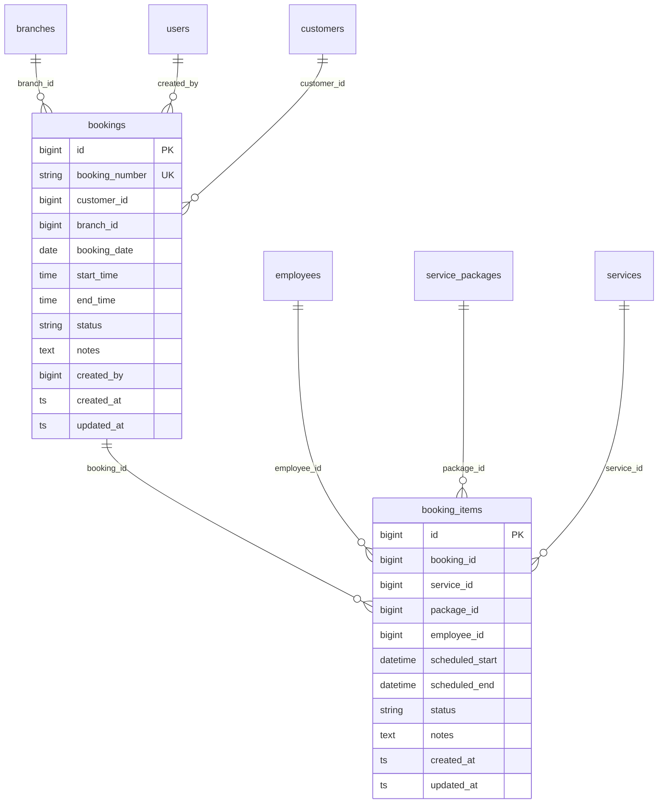
```mermaid
erDiagram
    bookings {
        bigint id PK
        string booking_number UK
        bigint customer_id
        bigint branch_id
        date booking_date
        time start_time
        time end_time
        string status
        text notes
        bigint created_by
        ts created_at
        ts updated_at
    }
    booking_items {
        bigint id PK
        bigint booking_id
        bigint service_id
        bigint package_id
        bigint employee_id
        datetime scheduled_start
        datetime scheduled_end
        string status
        text notes
        ts created_at
        ts updated_at
    }
    branches ||--o{ bookings : branch_id
    users ||--o{ bookings : created_by
    customers ||--o{ bookings : customer_id
    bookings ||--o{ booking_items : booking_id
    employees ||--o{ booking_items : employee_id
    service_packages ||--o{ booking_items : package_id
    services ||--o{ booking_items : service_id
```

### Sales (§14)

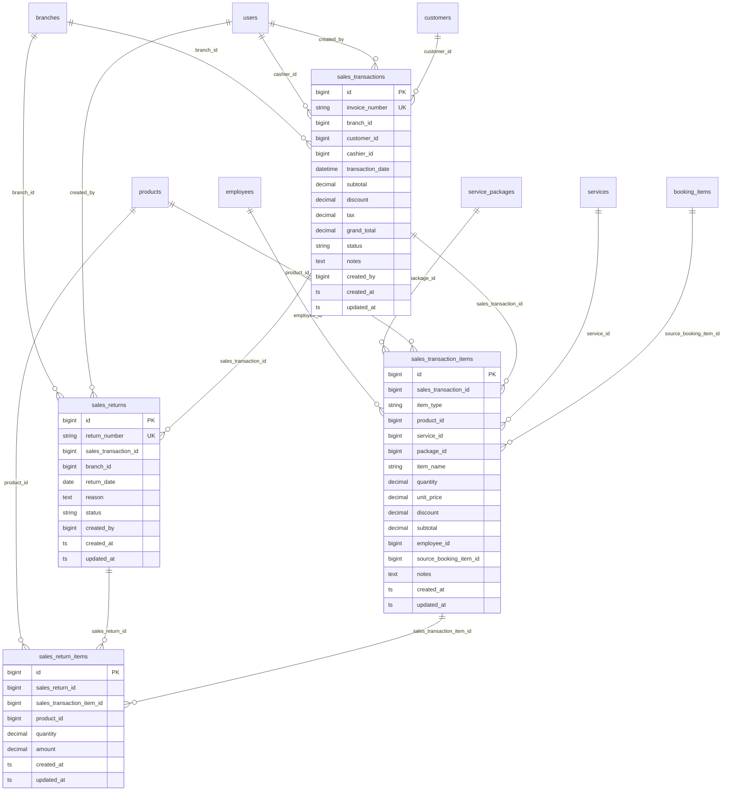
```mermaid
erDiagram
    sales_transactions {
        bigint id PK
        string invoice_number UK
        bigint branch_id
        bigint customer_id
        bigint cashier_id
        datetime transaction_date
        decimal subtotal
        decimal discount
        decimal tax
        decimal grand_total
        string status
        text notes
        bigint created_by
        ts created_at
        ts updated_at
    }
    sales_transaction_items {
        bigint id PK
        bigint sales_transaction_id
        string item_type
        bigint product_id
        bigint service_id
        bigint package_id
        string item_name
        decimal quantity
        decimal unit_price
        decimal discount
        decimal subtotal
        bigint employee_id
        bigint source_booking_item_id
        text notes
        ts created_at
        ts updated_at
    }
    sales_returns {
        bigint id PK
        string return_number UK
        bigint sales_transaction_id
        bigint branch_id
        date return_date
        text reason
        string status
        bigint created_by
        ts created_at
        ts updated_at
    }
    sales_return_items {
        bigint id PK
        bigint sales_return_id
        bigint sales_transaction_item_id
        bigint product_id
        decimal quantity
        decimal amount
        ts created_at
        ts updated_at
    }
    branches ||--o{ sales_transactions : branch_id
    users ||--o{ sales_transactions : cashier_id
    users ||--o{ sales_transactions : created_by
    customers ||--o{ sales_transactions : customer_id
    employees ||--o{ sales_transaction_items : employee_id
    service_packages ||--o{ sales_transaction_items : package_id
    products ||--o{ sales_transaction_items : product_id
    sales_transactions ||--o{ sales_transaction_items : sales_transaction_id
    services ||--o{ sales_transaction_items : service_id
    booking_items ||--o{ sales_transaction_items : source_booking_item_id
    branches ||--o{ sales_returns : branch_id
    users ||--o{ sales_returns : created_by
    sales_transactions ||--o{ sales_returns : sales_transaction_id
    products ||--o{ sales_return_items : product_id
    sales_returns ||--o{ sales_return_items : sales_return_id
    sales_transaction_items ||--o{ sales_return_items : sales_transaction_item_id
```

### Payment (§15)

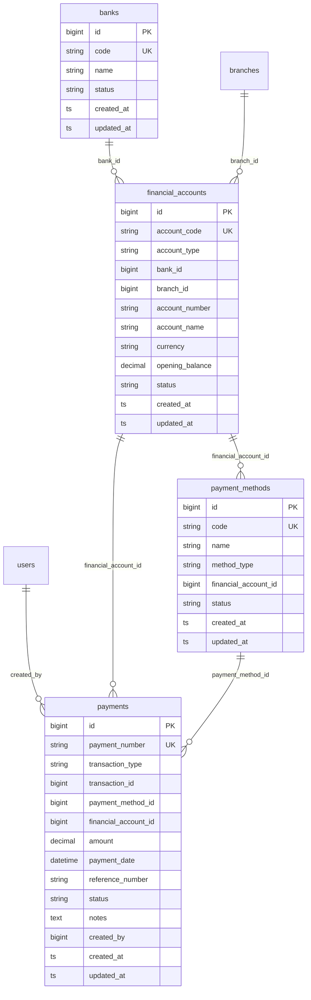
```mermaid
erDiagram
    banks {
        bigint id PK
        string code UK
        string name
        string status
        ts created_at
        ts updated_at
    }
    financial_accounts {
        bigint id PK
        string account_code UK
        string account_type
        bigint bank_id
        bigint branch_id
        string account_number
        string account_name
        string currency
        decimal opening_balance
        string status
        ts created_at
        ts updated_at
    }
    payment_methods {
        bigint id PK
        string code UK
        string name
        string method_type
        bigint financial_account_id
        string status
        ts created_at
        ts updated_at
    }
    payments {
        bigint id PK
        string payment_number UK
        string transaction_type
        bigint transaction_id
        bigint payment_method_id
        bigint financial_account_id
        decimal amount
        datetime payment_date
        string reference_number
        string status
        text notes
        bigint created_by
        ts created_at
        ts updated_at
    }
    banks ||--o{ financial_accounts : bank_id
    branches ||--o{ financial_accounts : branch_id
    financial_accounts ||--o{ payment_methods : financial_account_id
    users ||--o{ payments : created_by
    financial_accounts ||--o{ payments : financial_account_id
    payment_methods ||--o{ payments : payment_method_id
```

### Bank & Reconciliation (§16)

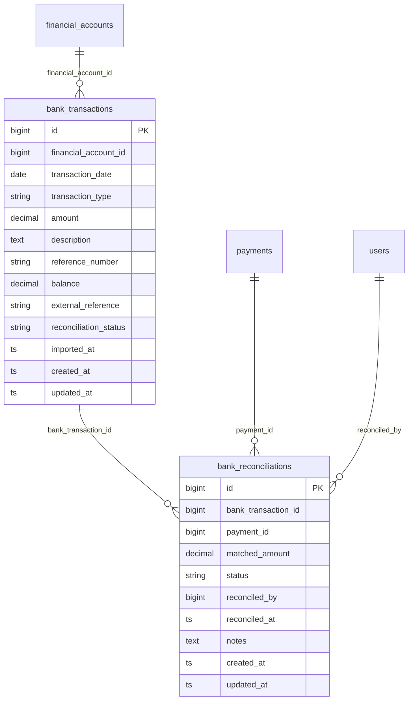
```mermaid
erDiagram
    bank_transactions {
        bigint id PK
        bigint financial_account_id
        date transaction_date
        string transaction_type
        decimal amount
        text description
        string reference_number
        decimal balance
        string external_reference
        string reconciliation_status
        ts imported_at
        ts created_at
        ts updated_at
    }
    bank_reconciliations {
        bigint id PK
        bigint bank_transaction_id
        bigint payment_id
        decimal matched_amount
        string status
        bigint reconciled_by
        ts reconciled_at
        text notes
        ts created_at
        ts updated_at
    }
    financial_accounts ||--o{ bank_transactions : financial_account_id
    bank_transactions ||--o{ bank_reconciliations : bank_transaction_id
    payments ||--o{ bank_reconciliations : payment_id
    users ||--o{ bank_reconciliations : reconciled_by
```

### Bills (§17)

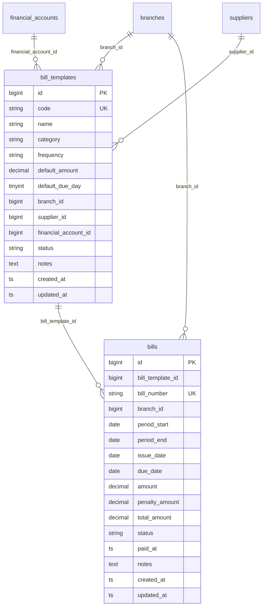
```mermaid
erDiagram
    bill_templates {
        bigint id PK
        string code UK
        string name
        string category
        string frequency
        decimal default_amount
        tinyint default_due_day
        bigint branch_id
        bigint supplier_id
        bigint financial_account_id
        string status
        text notes
        ts created_at
        ts updated_at
    }
    bills {
        bigint id PK
        bigint bill_template_id
        string bill_number UK
        bigint branch_id
        date period_start
        date period_end
        date issue_date
        date due_date
        decimal amount
        decimal penalty_amount
        decimal total_amount
        string status
        ts paid_at
        text notes
        ts created_at
        ts updated_at
    }
    branches ||--o{ bill_templates : branch_id
    financial_accounts ||--o{ bill_templates : financial_account_id
    suppliers ||--o{ bill_templates : supplier_id
    bill_templates ||--o{ bills : bill_template_id
    branches ||--o{ bills : branch_id
```

### Expense (§18)

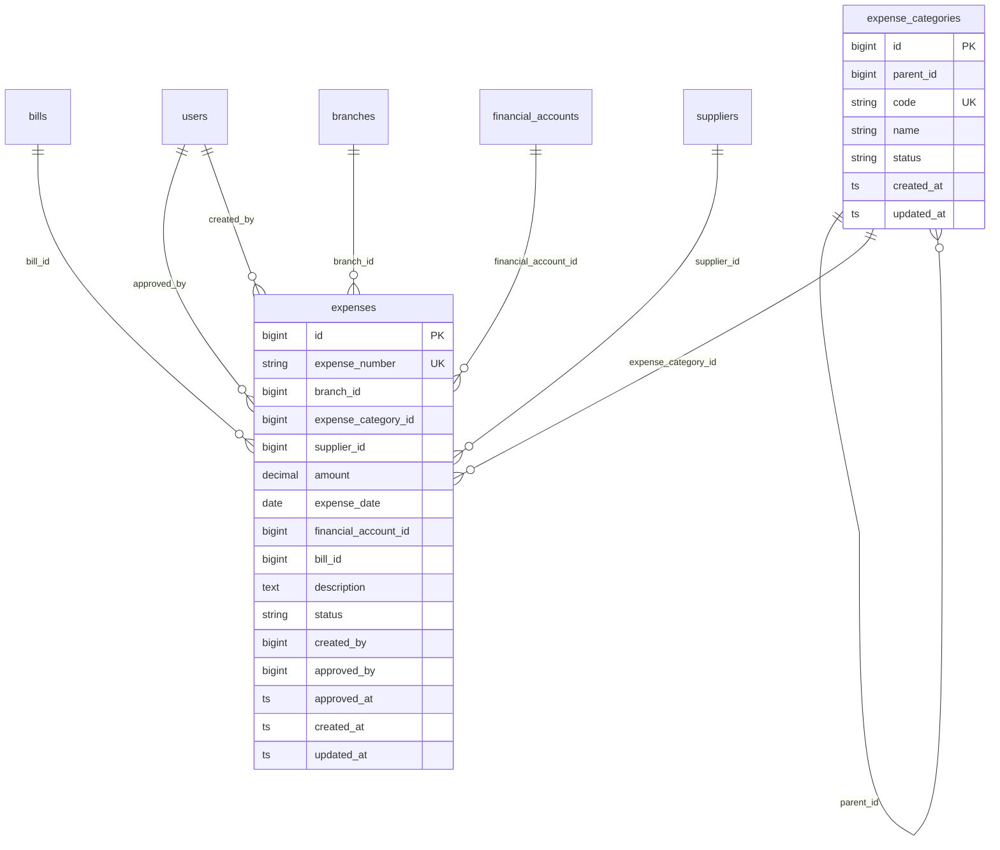
```mermaid
erDiagram
    expense_categories {
        bigint id PK
        bigint parent_id
        string code UK
        string name
        string status
        ts created_at
        ts updated_at
    }
    expenses {
        bigint id PK
        string expense_number UK
        bigint branch_id
        bigint expense_category_id
        bigint supplier_id
        decimal amount
        date expense_date
        bigint financial_account_id
        bigint bill_id
        text description
        string status
        bigint created_by
        bigint approved_by
        ts approved_at
        ts created_at
        ts updated_at
    }
    expense_categories ||--o{ expense_categories : parent_id
    users ||--o{ expenses : approved_by
    bills ||--o{ expenses : bill_id
    branches ||--o{ expenses : branch_id
    users ||--o{ expenses : created_by
    expense_categories ||--o{ expenses : expense_category_id
    financial_accounts ||--o{ expenses : financial_account_id
    suppliers ||--o{ expenses : supplier_id
```

### Payroll (§19)

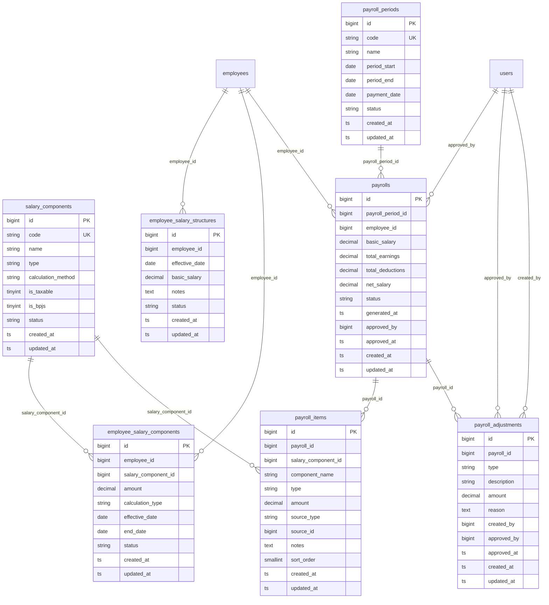
```mermaid
erDiagram
    payroll_periods {
        bigint id PK
        string code UK
        string name
        date period_start
        date period_end
        date payment_date
        string status
        ts created_at
        ts updated_at
    }
    salary_components {
        bigint id PK
        string code UK
        string name
        string type
        string calculation_method
        tinyint is_taxable
        tinyint is_bpjs
        string status
        ts created_at
        ts updated_at
    }
    employee_salary_structures {
        bigint id PK
        bigint employee_id
        date effective_date
        decimal basic_salary
        text notes
        string status
        ts created_at
        ts updated_at
    }
    employee_salary_components {
        bigint id PK
        bigint employee_id
        bigint salary_component_id
        decimal amount
        string calculation_type
        date effective_date
        date end_date
        string status
        ts created_at
        ts updated_at
    }
    payrolls {
        bigint id PK
        bigint payroll_period_id
        bigint employee_id
        decimal basic_salary
        decimal total_earnings
        decimal total_deductions
        decimal net_salary
        string status
        ts generated_at
        bigint approved_by
        ts approved_at
        ts created_at
        ts updated_at
    }
    payroll_items {
        bigint id PK
        bigint payroll_id
        bigint salary_component_id
        string component_name
        string type
        decimal amount
        string source_type
        bigint source_id
        text notes
        smallint sort_order
        ts created_at
        ts updated_at
    }
    payroll_adjustments {
        bigint id PK
        bigint payroll_id
        string type
        string description
        decimal amount
        text reason
        bigint created_by
        bigint approved_by
        ts approved_at
        ts created_at
        ts updated_at
    }
    employees ||--o{ employee_salary_structures : employee_id
    employees ||--o{ employee_salary_components : employee_id
    salary_components ||--o{ employee_salary_components : salary_component_id
    users ||--o{ payrolls : approved_by
    employees ||--o{ payrolls : employee_id
    payroll_periods ||--o{ payrolls : payroll_period_id
    payrolls ||--o{ payroll_items : payroll_id
    salary_components ||--o{ payroll_items : salary_component_id
    users ||--o{ payroll_adjustments : approved_by
    users ||--o{ payroll_adjustments : created_by
    payrolls ||--o{ payroll_adjustments : payroll_id
```

### Commission (§20)

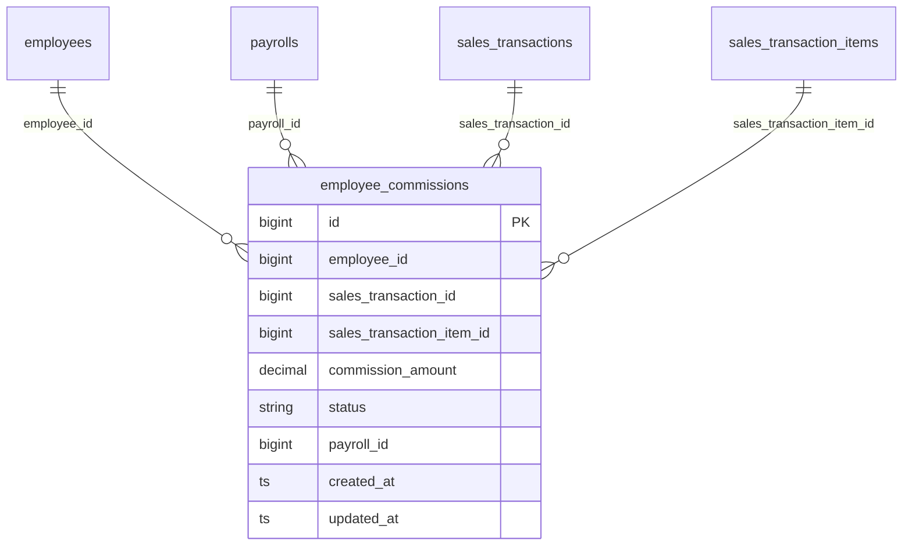
```mermaid
erDiagram
    employee_commissions {
        bigint id PK
        bigint employee_id
        bigint sales_transaction_id
        bigint sales_transaction_item_id
        decimal commission_amount
        string status
        bigint payroll_id
        ts created_at
        ts updated_at
    }
    employees ||--o{ employee_commissions : employee_id
    payrolls ||--o{ employee_commissions : payroll_id
    sales_transactions ||--o{ employee_commissions : sales_transaction_id
    sales_transaction_items ||--o{ employee_commissions : sales_transaction_item_id
```

### Payslip (§21)

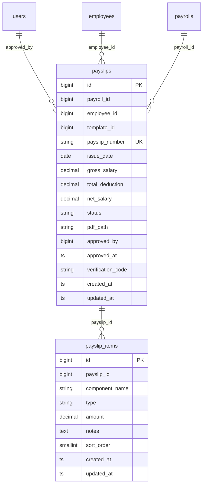
```mermaid
erDiagram
    payslips {
        bigint id PK
        bigint payroll_id
        bigint employee_id
        bigint template_id
        string payslip_number UK
        date issue_date
        decimal gross_salary
        decimal total_deduction
        decimal net_salary
        string status
        string pdf_path
        bigint approved_by
        ts approved_at
        string verification_code
        ts created_at
        ts updated_at
    }
    payslip_items {
        bigint id PK
        bigint payslip_id
        string component_name
        string type
        decimal amount
        text notes
        smallint sort_order
        ts created_at
        ts updated_at
    }
    users ||--o{ payslips : approved_by
    employees ||--o{ payslips : employee_id
    payrolls ||--o{ payslips : payroll_id
    payslips ||--o{ payslip_items : payslip_id
```

### Attendance & Shift (§22)

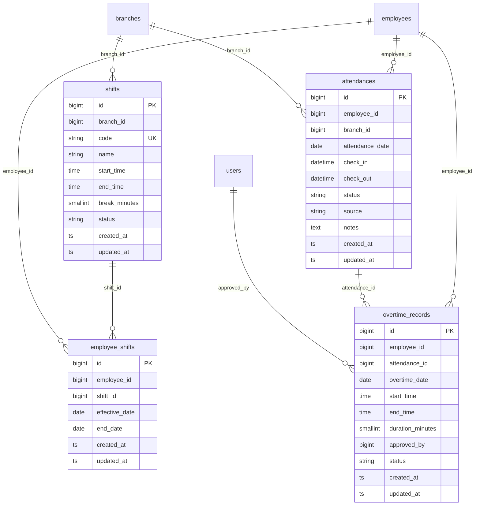
```mermaid
erDiagram
    shifts {
        bigint id PK
        bigint branch_id
        string code UK
        string name
        time start_time
        time end_time
        smallint break_minutes
        string status
        ts created_at
        ts updated_at
    }
    employee_shifts {
        bigint id PK
        bigint employee_id
        bigint shift_id
        date effective_date
        date end_date
        ts created_at
        ts updated_at
    }
    attendances {
        bigint id PK
        bigint employee_id
        bigint branch_id
        date attendance_date
        datetime check_in
        datetime check_out
        string status
        string source
        text notes
        ts created_at
        ts updated_at
    }
    overtime_records {
        bigint id PK
        bigint employee_id
        bigint attendance_id
        date overtime_date
        time start_time
        time end_time
        smallint duration_minutes
        bigint approved_by
        string status
        ts created_at
        ts updated_at
    }
    branches ||--o{ shifts : branch_id
    employees ||--o{ employee_shifts : employee_id
    shifts ||--o{ employee_shifts : shift_id
    branches ||--o{ attendances : branch_id
    employees ||--o{ attendances : employee_id
    users ||--o{ overtime_records : approved_by
    attendances ||--o{ overtime_records : attendance_id
    employees ||--o{ overtime_records : employee_id
```

### Asset & Document (§23)

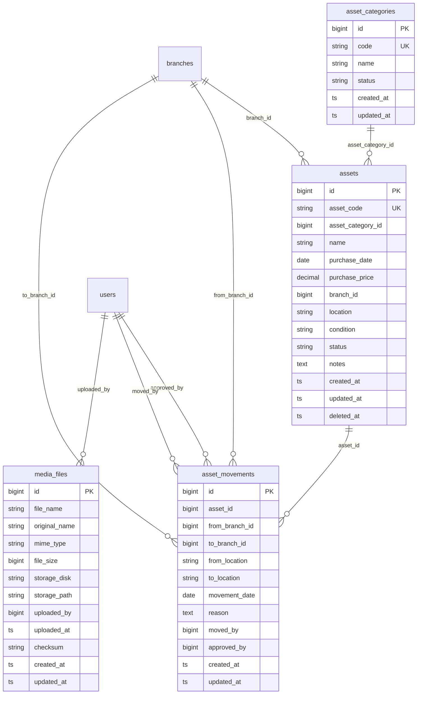
```mermaid
erDiagram
    asset_categories {
        bigint id PK
        string code UK
        string name
        string status
        ts created_at
        ts updated_at
    }
    assets {
        bigint id PK
        string asset_code UK
        bigint asset_category_id
        string name
        date purchase_date
        decimal purchase_price
        bigint branch_id
        string location
        string condition
        string status
        text notes
        ts created_at
        ts updated_at
        ts deleted_at
    }
    asset_movements {
        bigint id PK
        bigint asset_id
        bigint from_branch_id
        bigint to_branch_id
        string from_location
        string to_location
        date movement_date
        text reason
        bigint moved_by
        bigint approved_by
        ts created_at
        ts updated_at
    }
    media_files {
        bigint id PK
        string file_name
        string original_name
        string mime_type
        bigint file_size
        string storage_disk
        string storage_path
        bigint uploaded_by
        ts uploaded_at
        string checksum
        ts created_at
        ts updated_at
    }
    asset_categories ||--o{ assets : asset_category_id
    branches ||--o{ assets : branch_id
    users ||--o{ asset_movements : approved_by
    assets ||--o{ asset_movements : asset_id
    branches ||--o{ asset_movements : from_branch_id
    users ||--o{ asset_movements : moved_by
    branches ||--o{ asset_movements : to_branch_id
    users ||--o{ media_files : uploaded_by
```

### Digital Account (§24)

```mermaid
erDiagram
    digital_account_categories {
        bigint id PK
        string code UK
        string name
        string status
        ts created_at
        ts updated_at
    }
    digital_accounts {
        bigint id PK
        bigint category_id
        string name
        string username
        string email
        string url
        string owner_type
        bigint owner_id
        date renewal_date
        string status
        text notes
        ts created_at
        ts updated_at
    }
    digital_account_categories ||--o{ digital_accounts : category_id
```

### Approval & Audit (§25)

```mermaid
erDiagram
```
